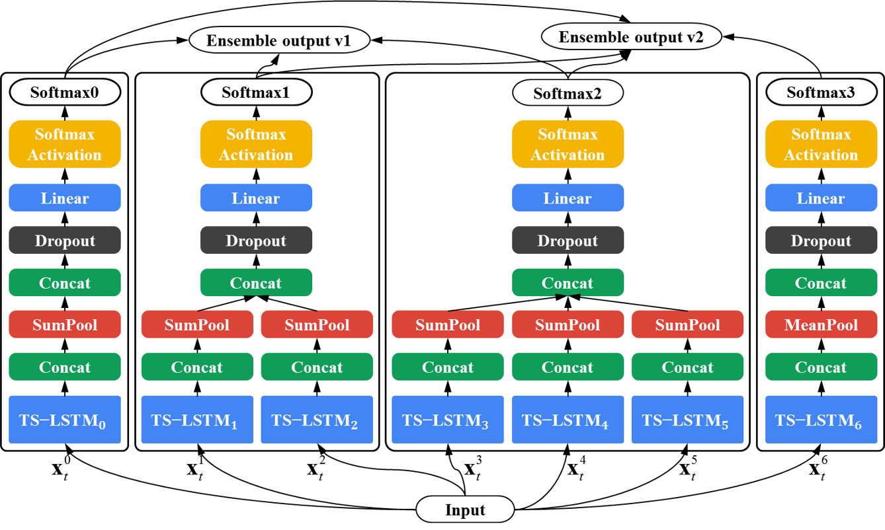

# Ensemble Deep Learning for Skeleton-based Action Recognition using Temporal Sliding LSTM networks

This paper addresses the problems of feature representation of skeleton joints and the modeling of temporal dynamics to recognize human actions. Traditional methods generally use relative coordinate systems dependent on some joints, and model only the long-term dependency, while excluding short-term and medium term dependencies. Instead of taking raw skeletons as the input, we transform the skeletons into another coordinate system to obtain the robustness to scale, rotation and translation, and then extract salient motion features from them. Considering that Long Short-term Memory (LSTM) networks with various time-step sizes can model various attributes well, we propose novel ensemble Temporal Sliding LSTM (TS-LSTM) networks for skeleton-based action recognition. The proposed network is composed of multiple parts containing short-term, medium-term and long-term TS-LSTM networks, respectively. In our network, we utilize an average ensemble among multiple parts as a final feature to capture various temporal dependencies. We evaluate the proposed networks and the additional other architectures to verify the effectiveness of the proposed networks, and also compare them with several other methods on five challenging datasets. The experimental results demonstrate that our network models achieve the state-of-the-art performance through various temporal features. Additionally, we analyze a relation between the recognized actions and the multi-term TS-LSTM features by visualizing the softmax features of multiple parts.

